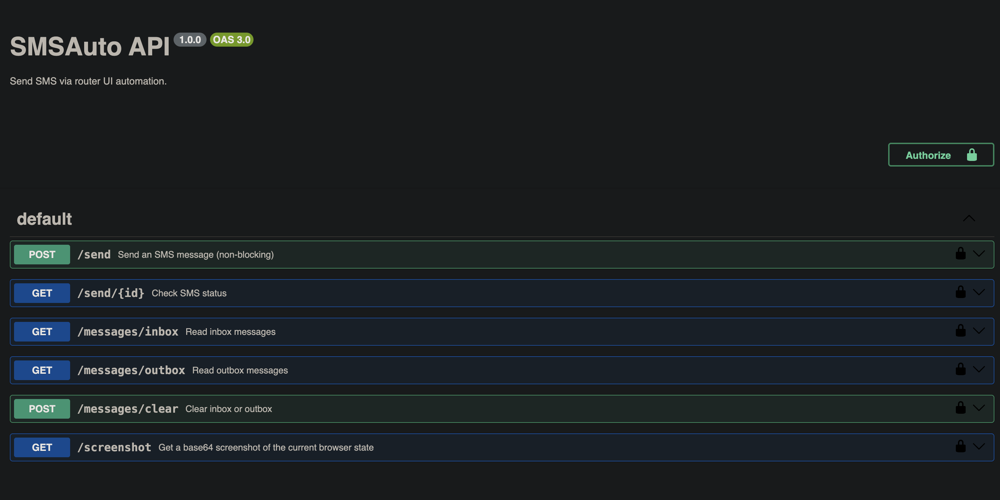

# SMSAuto



Playwright wrapper with Swagger UI for AliExpress 4G routers that automates SMS sending/receiving via the router's web interface.

## Features

- **Send SMS** via queue (non-blocking) with status tracking in SQLite database
- **Read inbox/outbox** messages from AliExpress 4G router
- **Clear inbox/outbox** messages
- **Idle inbox monitoring** - checks for new messages every 120s when idle
- **Webhook notifications** - POST to configured URL when new message received
- **Daily outbox clear** - automatically clears outbox at configured hour
- **Concurrency protection** - returns 503 if browser is busy
- **Swagger UI** - interactive API documentation at root endpoint

## Coolify Deployment

1. In Coolify, create a new **Docker Compose** resource
2. Point to your Git repository
3. Set environment variables:

| Variable | Required | Default | Description |
|----------|----------|---------|-------------|
| `ROUTER_URL` | Yes | `http://host.docker.internal:80` | AliExpress 4G router web UI URL |
| `ROUTER_USER` | No | `admin` | Router login username |
| `ROUTER_PASS` | No | `admin` | Router login password |
| `INBOX_CHECK_MS` | No | `120000` | Inbox check interval (ms) |
| `OUTBOX_CLEAR_HOUR` | No | `3` | Hour (0-23 UTC) to clear outbox |

**Compatibility:** Designed for AliExpress 4G routers with standard SMS web interface.

4. **Important**: The container needs network access to your router. Options:
   - Use `network_mode: host` in docker-compose.yml
   - Set `ROUTER_URL` to the router's LAN IP (e.g., `http://your-router-ip`)

## API Endpoints

### Send SMS
```bash
# Queue an SMS (non-blocking)
curl -X POST http://localhost:3000/send \
  -H 'Content-Type: application/json' \
  -d '{"to": "+447900000000", "text": "Hello!"}'

# Response: {"id":"msg-123","status":"queued","statusUrl":"/send/msg-123"}

# Check status
curl http://localhost:3000/send/msg-123
# Response: {"id":"msg-123","to":"+447900000000","message":"Hello!","status":"sent","createdAt":"...","sentAt":"..."}
```

### Inbox Status (idle polling)
```bash
curl http://localhost:3000/inbox/status
# Response: {"lastMessage":{"from":"+44...","content":"Hi","time":"2025/12/08 22:20:10"},"checkedAt":"...","isNew":true}
```

### Read Messages
```bash
curl http://localhost:3000/messages/inbox
curl http://localhost:3000/messages/outbox
```

### Clear Messages
```bash
curl -X POST http://localhost:3000/messages/clear \
  -H 'Content-Type: application/json' \
  -d '{"box": "outbox"}'
```

### Health Check
```bash
curl http://localhost:3000/healthz
```

## Local Development

```bash
# Install dependencies
npm install

# Run locally
ROUTER_URL=http://your-router-ip npm start

# Or with Docker
docker build -t smsauto .
docker run -p 3000:3000 -e ROUTER_URL=http://your-router-ip smsauto
```

## Swagger UI Documentation

Interactive API documentation is available at the root endpoint:
- **Local:** `http://localhost:3000/`
- **Production:** `http://your-server:3324/`

The Swagger UI provides:
- Interactive API testing
- Request/response examples
- Authentication setup
- Full endpoint documentation

---


